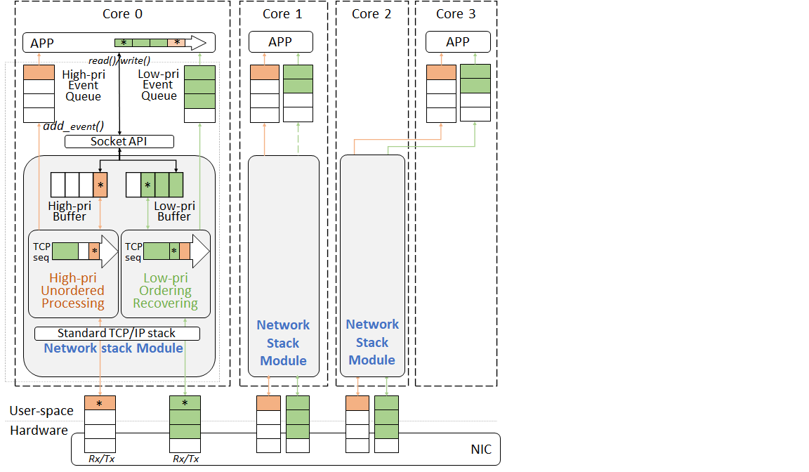

# README

QStack is an efficient user-space TCP/IP network stack based on DPDK.
QStack could serve workloads with high concurrency, up to tens of millions of concurrent TCP connections.
QStack provides flexible thread allocation and arrangement to fit application requirements.
QStack supports user-defined packet-level priority scheduling to guarantee response tail latency of high-priority requests.
QStack can provide low tail latency for latency-sensitive requests with high priority under high concurrent loads.
In our IoT high-concurrency benchmark, QStack maintained a tail latency of 3.5 milliseconds for high-priority requests while serving 1 million concurrent TCP connections.

QStack source code is distributed under the Mulan PSL v2 License.
QStack uses part of ``mTCP`` source code for TCP/IP processing.
QStack uses part of ``libco`` source code for coroutine management.


Architecture

 

Supported features
 - architecture: flexible thread allocation and arrangement, full-stack lock-free, user-level threading, zero-copy datapath, supports 10 million concurrent TCP connections
 - scheduling: user-defined priority classification, prioritized TCP with unordered recv/send, prioritized event-framework

## Prerequisites

We require the following libraries to run QStack.
- `libnuma` (libnuma.so.1.0.0)
- `libpthread` (libpthread-2.17)
- `openssl-devel`(1.0.2k-24)

## Included directories

- qstack: source code directory of the network stack
- dpdk: Intel's Data Plane Development Kit
- apps: QStack applications
- qcoroutine: source code directory of the user-level thread framework
- mempool: source code directory of the mempool management
- tools: basic structure supports for QStack

## Tested environments

QStack runs on Linux-based operating systems with generic x86_64 CPUs, 
but to help evaluation, we provide our tested environments as follows.

    Intel(R) Xeon(R) Gold 6130 CPU @ 2.10GHz, 
    128 GB of RAM,
    82599ES 10-Gigabit SFI/SFP+,
    CentOS Linux release 7.6.1810 (Linux 3.10.0)

## Benchmark

### iotepserver

iotepserver is a benchmark of IoT server serving bursty workloads with high concurrency. 
The requests received by iotepserver are classified to request messages and heartbeat messages. 
Both of them will query the Redis database, but only send back responses to request messages. 

### Testbed setup

The iotepserver benchmark requires 1 server, 1 client and 1 monitor. 
- The server machine needs to have at least 64 logic cores (with hyper-thread enabled) with at least 64GB RAM (reserve 20GB hugepage for each NUMA node), 10Gbps NIC.

- Note: the NIC should be supported by DPDK drivers, see http://dpdk.org/doc/nics for the support list.
- Note: the user could decrease the max concurrency support by modify ``MAX_FLOW_NUM`` in ``<qstack_home>/qstack/src/include/typical_macro_iotepserver.h`` to run QStack with less memory.
- Note: our current thread layout is optimized for the architecture in our tested environment. Adjust ``PHYSOCK_NUM`` and ``CORE_PER_SOCK`` in ``<qstack_home>/qstack/src/include/typical_macro_iotepserver.h`` based on the actual architecture in use for the optimal thread layout, and then run ``make.sh`` again.

### QStack install 

1. Install and set up Intel's DPDK driver.
    prepare DPDK source code
    ```
    # cd <qstack_home>
    # tar xvf deps/dpdk.tar.gz -C ./
    # cd dpdk
    # git apply ../deps/dpdk-patch
    ```

    use the following steps in the ``/dpdk/usertools/dpdk-setup.sh `` script for setup:
    ``` 
    - Press [14] to compile the package
    - Press [17] to install the driver
    - Press [21] to setup hugepages, input 10240 for every NUMA node with 2M hugepages, and input 20 for every NUMA node with 1G hugepages.
    - Press [23] to register the Ethernet ports
    - Press [34] to quit the tool
    ```
    Check that DPDK package creates a new directory of compiled
  libraries. For x86_64 machines, the new subdirectory should be
  ``dpdk/x86_64-native-linuxapp-gcc``

2. Create soft links for ``include/`` and ``lib/`` directories inside
   empty ``dpdk-lnk/`` directory: 
    ```
    # cd <qstack_home>
    # mkdir dpdk-lnk
    # cd dpdk-lnk
    # ln -s ../dpdk/x86_64-native-linuxapp-gcc/lib lib
    # ln -s ../dpdk/x86_64-native-linuxapp-gcc/include include
    ```

3. Prepare redis as iotepserver backend server
    install redis
    ```
    # tar xvf <qstack_home>/deps/redis-4.0.2.tar.gz -C /home/
    # cd /home/redis-4.0.2; make; make install
    # cd deps/hiredis; make; make install
    ```
    Note: we strongly recommend to install redis at ``/home/redis-4.0.2``, as it's the default path for redis in the following redis-setup scripts
    
    setup redis
    ```
    # export LD_LIBRARY_PATH=$LD_LIBRARY_PATH:/usr/local/lib
    # mkdir /var/run/redis
    # cd <qstack_home>/redis-scripts
    # ./dir-redis.sh 16 sock
    # cd <qstack_home>/apps/redis; make
    ```

4. Make QStack
	```
    # cd <qstack_home>/qstack/src;./make.sh
    ```
### QStack start

1. start redis
    ```
    # cd <qstack_home>/redis-scripts
    # ./setup-redis.sh 16 up sock
    ```
    Note: the param ``16`` refer to start 16 redis-server;
    
2. start iotepserver
    ```
    # cd <qstack_home>/apps/build
    # ./iotepserver -f 32 -i [host_ip] 2>err
    ```
        -f : refers to the TCP header length of requests, used for priority classification of every packet.
        [host_ip] : refers to the local IP address, and the server listens on the port 80.

### Client setup and start

In iotepserver benchmark, we use MCC as the workload generator running on the client.
MCC is an open-source network workload generator which could generate bursty workload with extremely high concurrency.

1. Install MCC 
  - download MCC from https://gitee.com/acs-dcn/MCC
  - install and build MCC
  - modify the config files for MCC, the ``max_concurrency`` and ``max_num_buffers`` in ``mtcp.conf`` should be no less than 1500000

2. start client
    ```
    # cd <mcc>/build/release/apps/mcc
    # ./mcc -c 10368000 -b 172800 -e 60 -s 200 -w 20 -l 200 -r 0.05 --ips 230 --log-duration 60 --network-stack mtcp --dest 192.168.3.10 --smp 9 2>err
    ```
        -c : the number of concurrent TCP connections. 
        -b : the requets to be send every second, which should be 1/60 of the concurrency. 
        -s : the time to establish the connections. 
        -e : the interval between two requests in every TCP connection. 
        -l : the request length
        -r : the proportion of high-priority requests
        --ips : the number of host ip address
        --dest : the dest (server) ip address 
        --smp : the number of application thread used by MCC. 

### Monitor setup and start

In iotepserver benchmark, we use HCMonitor to estimate the response latency.
HCMonitor is an open-source high-performance monitor system which could accurately estimate the response latency with full traffic under high-concurrent workload.

1. Install HCMonitor
  - download HCMonitor from https://gitee.com/acs-dcn/HCMonitor
  - install and build HCMonitor

2. setup switch mirroring
  - configure the switch port connected to HCMonitor to mirror the inbound and outbound traffic from the server machine (see ``README`` from HCMonitor).

3. start monitor
    ```
    ./build/monitor -c fff -n3 -- -p1
    ```
4. see latency statistics results in ``cdf.txt``.

### Our result

We test iotepserver with 10,368,000 concurrent TCP connections on machines of ``Tested environments``, and the 99th tail latency estimated by HCMonitor is about 2.4ms. 

## Frequently asked questions

1. How can I quit the application?
    - Use ctrl+C to force quit.

## Release note

### Sep 19, 2022
* **Updated global macro.**

    The following macro in ``qstack/src/include/mbuf.h`` can cause zero window,
 and it's disabled now:  - ``MBUF_STREAMID``

* **Check MAC address for IP packets, accept broadcast ARP requests.**

* **Ignore local path changes in tools.**

### April 22, 2022
* **Updated global macros.**
    
    The following two macros in ``qstack/src/include/global_macro.h`` can cause fatal errors, and they are disabled now:
  - ``SCAN_INACTIVE_SOCKET``
  - ``ACTIVE_DROP_EMULATE``

* **Updated dpdk-patch and dpdk_module.**

    The dpdk-patch was simplified, so that QStack doesn't modify DPDK too much now. 

* **Added MAC and IP check when receiving a packet.**

* **Removed uncompleted in-stack SSL.**

### V1.0
 - flexible thread allocation and arrangement
 - packet-level priority support at driver layer
 - prioritized TCP with unordered recv/send
 - prioritized event-framework
 - iotepserver supporting 10 million concurrent TCP connections
 - full-stack lock-free
 - user-level threading
 - zero-copy datapath

## Acknowledgments

QStack is a high-concurrency-and-low-latency user-level TCP stack for multicore systems. The version 1.0 is able to support 10 million concurrent TCP long connections, using a cloud-supported IoT application scenario. The work was supported by the Strategic Priority Research Program of the Chinese Academy of Sciences under Grant No. XDA06010401, the National Key Research and Development Program of China under Grant No. 2016YFB1000203 & 2017YFB1001602. We appreciated project leaders, Prof. Xu Zhiwei, Prof. Chen Mingyu and Prof. Bao Yungang, for their selfless support and guidance. We also appreciated the QStack team for their efforts. Among them, Shen Yifan is responsible for the system design and development of the TCP protocol stack, Song Hui is responsible for the event framework, Zhang Zhao is responsible for the user-level driver. Wang Zhuang, Feng Xiao and Wu Wenqing are responsible for the development of the high concurrency generator MCC, Song Hui is responsible for the development of full traffic monitor HCMonitor, which are important tools for QStack test. And Li Zixuan and Wang Haokun also help to developed some tools and do a large number of tests.

## Contacts
Issue board is the preferred way to report bugs and ask questions about QStack or contact Zhang Wenli (zhangwl at ict.ac.cn).
